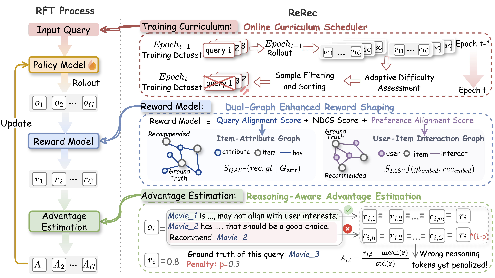
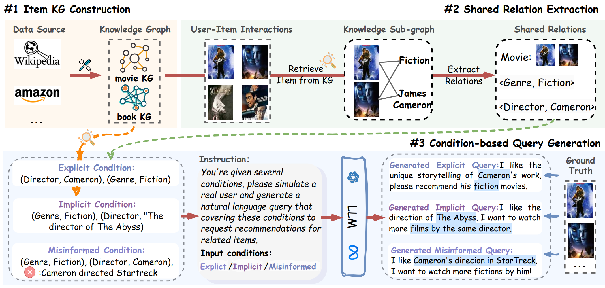
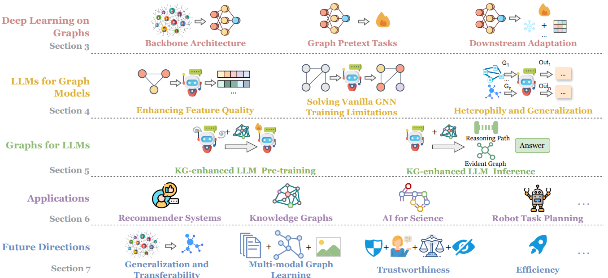
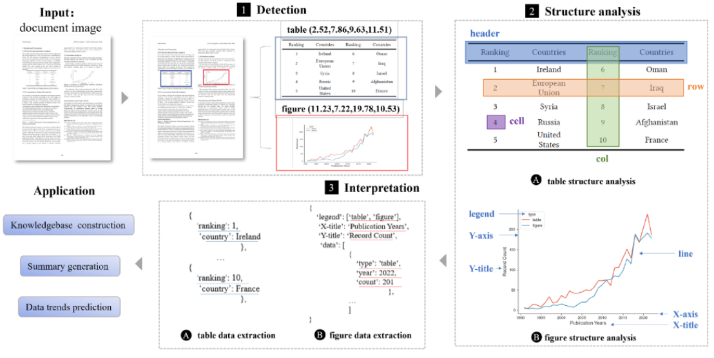
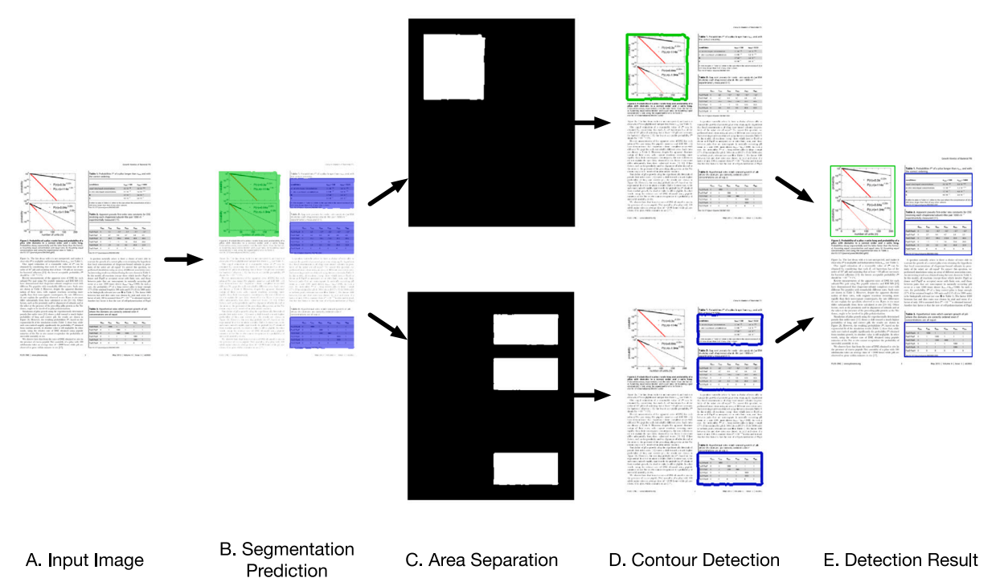








I am a second-year PhD student at the Hong Kong Polytechnic University, under the supervison of <a href='https://www4.comp.polyu.edu.hk/~csqli/'>Prof. Qing Li</a>. I was a mphil at <a href='http://39.103.203.133/'>Information Retrieval and Knowledge Mining Laboratory</a> under the supervision by <a href='https://sim.whu.edu.cn/info/1631/13983.htm'>Prof. Wei Lu</a> and <a href='https://simjwz.whu.edu.cn/info/1391/11051.htm'>Dr. Yu</a>.

My research interest includes recommender system and large language model. Please feel free to contact me by email if you are seeking related academic collaborations.

<!-- I have published more than 100 papers at the top international AI conferences with total <a href='https://scholar.google.com/citations?user=gPBckEwAAAAJ'>google scholar citations <strong>260000+</strong></a> (You can also use google scholar badge ). -->

# 🔥 News

- *2026.04*: &nbsp; Our paper “*ReRec: Reasoning-Augmented LLM-based Recommendation Assistant via Reinforcement Fine-tuning*” has been accepted by **ACL 2026**.

- *2025.10*: &nbsp; Our benchmark paper “*Towards Next-Generation Recommender Systems: A Benchmark for Personalized Recommendation Assistant with LLMs*” has been accepted by **WSDM 2026**.

<!-- - *2025.10*: &nbsp; Check out our paper on <a href='https://arxiv.org/pdf/2510.14629'>“*MR.Rec: Synergizing Memory and Reasoning for Personalized Recommendation Assistant with LLMs*”</a>.

- *2025.03*: &nbsp; Check out our paper on <a href='https://arxiv.org/abs/2503.09382'>"*Towards Next-Generation Recommender Systems: A Benchmark for Personalized Recommendation Assistant with LLMs*"</a>. -->
- *2025.03*: &nbsp; Our survey paper on "*Graph Machine Learning in the Era of Large Language Models (LLMs)*" has been accepted by **ACM TIST**.
<!-- - *2024.04*: &nbsp; Check our newest survey <a href='https://arxiv.org/abs/2404.14928'>"*Graph Machine Learning in the Era of Large Language Models (LLMs)*"</a>. -->
- *2024.04*: &nbsp;🎉🎉 Our paper has been accepted by ACM Computing Surveys. 

# 📝 Publications 

  

    

      
    

    
ReRec: Reasoning-Augmented LLM-based Recommendation Assistant via Reinforcement Fine-tuning

    
<strong>Jiani Huang</strong>, Shijie Wang, Liangbo Ning, Wenqi Fan, Qing Li

    
ACL 2026

    
With the rise of LLMs, there is an increasing need for intelligent recommendation assistants that can handle complex queries and provide personalized, reasoning-driven recommendations. LLM-based recommenders show potential but face challenges in multi-step reasoning, underscoring the need for reasoning-augmented systems. To address this gap, we propose ReRec, a novel reinforcement fine-tuning (RFT) framework designed to improve LLM reasoning in complex recommendation tasks. Our framework introduces three key components: (1) Dual-Graph Enhanced Reward Shaping, integrating recommendation metrics like NDCG@K with Query Alignment and Preference Alignment Scores to provide fine-grained reward signals for LLM optimization; (2) Reasoning-aware Advantage Estimation, which decomposes LLM outputs into reasoning segments and penalizes incorrect steps to enhance reasoning of recommendation; and (3) Online Curriculum Scheduler, dynamically assess query difficulty and organize training curriculum to ensure stable learning during RFT. Experiments demonstrate that ReRec outperforms state-of-the-art baselines and preserves core abilities like instruction-following and general knowledge. 

    

      <a href='https://arxiv.org/abs/2604.07851'>Paper</a>
      <a href='https://github.com/jiani-huang/ReRec'>Code</a>
    

  

  

    

      
    

    
Towards Next-Generation Recommender Systems: A Benchmark for Personalized Recommendation Assistant with LLMs

    
<strong>Jiani Huang</strong>, Shijie Wang, Liangbo Ning, Wenqi Fan, Shuaiqiang Wang, Dawei Yin, Qing Li

    
WSDM 2026

    
Recommender systems (RecSys) are widely used across various modern digital platforms and have garnered significant attention. Traditional recommender systems usually focus only on fixed and simple recommendation scenarios, making it difficult to generalize to new and unseen recommendation tasks in an interactive paradigm. Recently, the advancement of large language models (LLMs) has revolutionized the foundational architecture of RecSys, driving their evolution into more intelligent and interactive personalized recommendation assistants. However, most existing studies rely on fixed task-specific prompt templates to generate recommendations and evaluate the performance of personalized assistants, which limits the comprehensive assessments of their capabilities. This is because commonly used datasets lack high-quality textual user queries that reflect real-world recommendation scenarios, making them unsuitable for evaluating LLM-based personalized recommendation assistants. To address this gap, we introduce RecBench+, a new dataset benchmark designed to assess LLMs’ ability to handle intricate user recommendation needs in the era of LLMs. RecBench+ encompasses a diverse set of queries that span both hard conditions and soft preferences, with varying difficulty levels. We evaluated commonly used LLMs on RecBench+ and uncovered below findings: 1) LLMs demonstrate preliminary abilities to act as recommendation assistants, 2) LLMs are better at handling queries with explicitly stated conditions, while facing challenges with queries that require reasoning or contain misleading information. 

    

      <a href='https://arxiv.org/abs/2503.09382'>Paper</a>
      <a href='https://github.com/jiani-huang/RecBench'>Code</a>
    

  

  

    

      
    

    
Graph Machine Learning in the Era of Large Language Models (LLMs)

    
Shijie Wang*, <strong>Jiani Huang*</strong>, Wenqi Fan, Zhikai Chen, Yu Song, Wenzhuo Tang, Haitao Mao, Hui Liu, Xiaorui Liu, Dawei Yin, Qing Li

    
ACM Transactions on Intelligent Systems and Technology

    
Graphs play an important role in representing complex relationships in various domains like social networks, knowledge graphs, and molecular discovery. With the advent of deep learning, Graph Neural Networks (GNNs) have emerged as a cornerstone in Graph Machine Learning (Graph ML), facilitating the representation and processing of graph structures. Recently, LLMs have demonstrated unprecedented capabilities in language tasks and are widely adopted in a variety of applications such as computer vision and recommender systems. This remarkable success has also attracted interest in applying LLMs to the graph domain. Increasing efforts have been made to explore the potential of LLMs in advancing Graph ML's generalization, transferability, and few-shot learning ability. Meanwhile, graphs, especially knowledge graphs, are rich in reliable factual knowledge, which can be utilized to enhance the reasoning capabilities of LLMs and potentially alleviate their limitations such as hallucinations and the lack of explainability. Given the rapid progress of this research direction, a systematic review summarizing the latest advancements for Graph ML in the era of LLMs is necessary to provide an in-depth understanding to researchers and practitioners. Therefore, in this survey, we first review the recent developments in Graph ML. We then explore how LLMs can be utilized to enhance the quality of graph features, alleviate the reliance on labeled data, and address challenges such as graph heterogeneity and out-of-distribution (OOD) generalization. Afterward, we delve into how graphs can enhance LLMs, highlighting their abilities to enhance LLM pre-training and inference. Furthermore, we investigate various applications and discuss the potential future directions in this promising field.

    

      <a href='https://arxiv.org/abs/2404.14928'>Paper</a>
    

  

  

    

      
    

    
From Detection to Application: Recent Advances in Understanding Scientific Tables and Figures

    
<strong>Jiani Huang</strong>, Haihua Chen, Fengchang Yu, Wei Lu

    
ACM Computing Surveys

    
Tables and figures are usually used to present information in a structured and visual way in scientific documents. Understanding the tables and figures in scientific documents is significant for a series of downstream tasks, such as academic search, scientific knowledge graphs, and so on. Existing studies mainly focus on detecting figures and tables from scientific documents, interpreting their semantics, and integrating them into downstream tasks. However, a systematic and comprehensive literature review on the mining and application of tables and figures in academic papers is still missing. In this article, we introduce the research framework and the whole pipeline for understanding tables and figures, including detection, structural analysis, interpretation, and application. We deliver a thorough analysis of benchmark datasets, recent techniques, and their pros and cons. Additionally, a quantitative analysis of the effectiveness of different models on popular benchmarks is presented. We further outline several important applications that exploit the semantics of scientific tables and figures. Finally, we highlight the challenges and some potential directions for future research. We believe this is the first comprehensive survey in understanding scientific tables and figures that covers the landscape from detection to application.

    

      <a href='https://dl.acm.org/doi/pdf/10.1145/3657285'>Paper</a>
    

  

  

    

      
    

    
An effective method for figures and tables detection in academic literature

    
Fengchang Yu, <strong>Jiani Huang</strong>, Wei Lu

    
Information Processing &amp; Management

    
Figures and tables in scientific articles serve as data sources for various academic data mining tasks. These tasks require input data to be in its entirety. However, existing studies measure the performance of algorithms using the same IoU (Intersection over Union) or IoU-based metrics that are used for natural situations. There is a gap between high IoU and detection entirety in scientific figures and tables detection tasks. In this paper, we demonstrate the existence of this gap and suggest that the leading cause is the detection error in the boundary area. We propose an effective detection method that cascades semantic segmentation and contour detection. The semantic segmentation model adopted a novel loss function to enhance the weights of boundary parts and a categorized dice metric to evaluate the imbalanced pixels in the segmentation result. Under rigorous testing criteria, the method proposed in this paper yielded a page-level F1 of 0.983 exceeding state-of-the-art academic figure and table detection methods. The research results in this paper can significantly improve the data quality and reduce data cleaning costs for downstream applications.

    

      <a href='https://www.sciencedirect.com/science/article/pii/S0306457323000237'>Paper</a>
    

  

# 🎖 Honors and Awards
- *2021.09* Graduate Entrance Scholarship (**top 10%**), *Wuhan University*
- *2020.11* The National Bronze Award in The 11th Challenge Cup Competition, *Ministry of Education of China*
- *2019.09* Outstanding Student First-Class Scholarship, *Wuhan University*
- *2018.11* The Third Prize of the 10th National University Mathematics Competition, *Ministry of Education of China*

# 📖 Educations
- *2021.09 - 2024.06*, Mphil, Wuhan University. 
- *2017.09 - 2021.06*, Undergraduate, Wuhan University. 

<!-- # 💬 Invited Talks
- *2021.06*, Lorem ipsum dolor sit amet, consectetur adipiscing elit. Vivamus ornare aliquet ipsum, ac tempus justo dapibus sit amet. 
- *2021.03*, Lorem ipsum dolor sit amet, consectetur adipiscing elit. Vivamus ornare aliquet ipsum, ac tempus justo dapibus sit amet.  \| [\[video\]](https://github.com/) -->

# 💻 Internships
<!-- - *2020.05 - 2020.10*, [Lorem](https://github.com/), China. -->
- *2023.04 - 2023.10*, PingAn Technology , Shenzhen.
- *2020.05 - 2020.10*, NetEase, Beijing.
